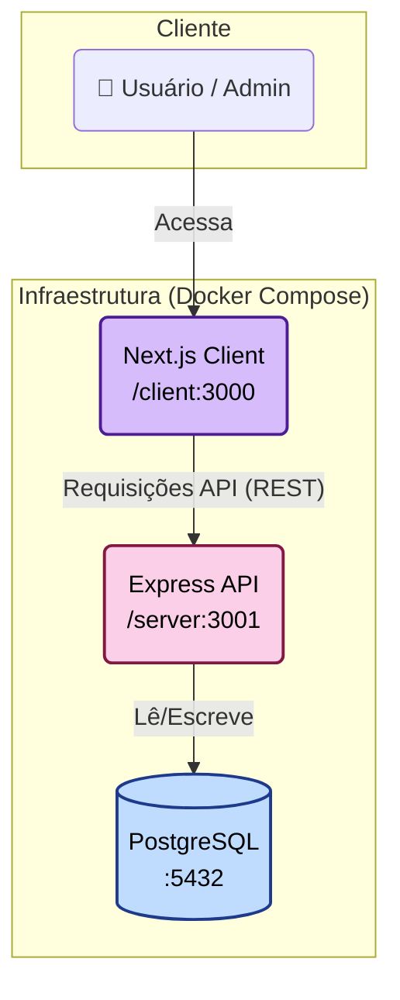

# ARQUITETURA DO PROJETO

## Diagrama da arquitetura



# Modelo de dados

- Optei por utilizar um banco de dados SQL como Postgres por alguns motivos:

  - Perceber entidades nas funcionalidades como: membros, intenções de participação, avisos, indicações e como elas se relacionam. Ex: um possível membro possui uma intenção de participação, membros tem acesso a avisos, que por sua vez são criados por admins. Indicações são feitas de um membro para outro, etc.

  - Garante integridade de dados através de chaves primárias e secundárias, assim como normalização, que garante um armazenamento eficiente e evita redudância de dados ao longo do tempo.

  - Como escolhi implementar o módulo opcional B (Dashboard de performance), vi uma vantagem em utilizar o modelo relacional pois será primordial pois as relações entre entidades são nítidas e ocorrerão através de JOINs entre múltiplas tabelas e agregações com COUNT e SUM, a fim de gerar relatórios detalhados, por exemplo.

- Dito isso, apresento abaixo o modelo de dados com tabelas, campos e relacionamentos.

```
CREATE TYPE status_intencao AS ENUM ('pendente', 'aprovada', 'rejeitada');
CREATE TYPE status_indicacao AS ENUM ('enviada', 'em_andamento', 'fechada', 'rejeitada');
CREATE TYPE status_fatura AS ENUM ('pendente', 'paga', 'vencida');
CREATE TYPE tipo_usuario AS ENUM ('membro', 'admin');

CREATE TABLE intencoes (
    id UUID PRIMARY KEY DEFAULT gen_random_uuid(),
    nome VARCHAR(255) NOT NULL,
    email VARCHAR(255) NOT NULL UNIQUE,
    empresa VARCHAR(255),
    motivo TEXT,
    status status_intencao DEFAULT 'pendente',
    criado_em TIMESTAMP WITH TIME ZONE DEFAULT NOW(),
    atualizado_em TIMESTAMP WITH TIME ZONE DEFAULT NOW()
);

CREATE TABLE usuarios (
    id UUID PRIMARY KEY DEFAULT gen_random_uuid(),
    nome VARCHAR(255) NOT NULL,
    email VARCHAR(255) NOT NULL UNIQUE,
    senha_hash VARCHAR(255) NOT NULL,
    empresa VARCHAR(255),
    tipo tipo_usuario DEFAULT 'membro',
    ativo BOOLEAN DEFAULT true,
    criado_em TIMESTAMP WITH TIME ZONE DEFAULT NOW()
);

CREATE TABLE convites (
    id UUID PRIMARY KEY DEFAULT gen_random_uuid(),
    email VARCHAR(255) NOT NULL,
    token VARCHAR(255) NOT NULL UNIQUE,
    intencao_id UUID REFERENCES intencoes(id),
    expira_em TIMESTAMP WITH TIME ZONE NOT NULL,
    usado_em TIMESTAMP WITH TIME ZONE,
    criado_em TIMESTAMP WITH TIME ZONE DEFAULT NOW()
);

CREATE TABLE reunioes (
    id UUID PRIMARY KEY DEFAULT gen_random_uuid(),
    data DATE NOT NULL,
    topico VARCHAR(255),
    criado_em TIMESTAMP WITH TIME ZONE DEFAULT NOW()
);

CREATE TABLE presencas (
    id UUID PRIMARY KEY DEFAULT gen_random_uuid(),
    usuario_id UUID NOT NULL REFERENCES usuarios(id) ON DELETE CASCADE,
    reuniao_id UUID NOT NULL REFERENCES reunioes(id) ON DELETE CASCADE,
    checkin BOOLEAN DEFAULT false,
    UNIQUE(usuario_id, reuniao_id)
);

CREATE TABLE indicacoes (
    id UUID PRIMARY KEY DEFAULT gen_random_uuid(),
    id_indicador UUID NOT NULL REFERENCES usuarios(id),
    id_indicado UUID NOT NULL REFERENCES usuarios(id),
    contato_nome VARCHAR(255) NOT NULL,
    descricao_oportunidade TEXT,
    status status_indicacao DEFAULT 'enviada',
    criado_em TIMESTAMP WITH TIME ZONE DEFAULT NOW()
);

CREATE TABLE agradecimentos (
    id UUID PRIMARY KEY DEFAULT gen_random_uuid(),
    id_agradecedor UUID NOT NULL REFERENCES usuarios(id),
    id_agradecido UUID NOT NULL REFERENCES usuarios(id),
    mensagem TEXT,
    indicacao_id UUID REFERENCES indicacoes(id),
    criado_em TIMESTAMP WITH TIME ZONE DEFAULT NOW()
);

CREATE TABLE encontros_1a1 (
    id UUID PRIMARY KEY DEFAULT gen_random_uuid(),
    membro1_id UUID NOT NULL REFERENCES usuarios(id),
    membro2_id UUID NOT NULL REFERENCES usuarios(id),
    data_encontro DATE NOT NULL,
    observacoes TEXT,
    criado_em TIMESTAMP WITH TIME ZONE DEFAULT NOW()
);

CREATE TABLE faturas (
    id UUID PRIMARY KEY DEFAULT gen_random_uuid(),
    usuario_id UUID NOT NULL REFERENCES usuarios(id),
    valor DECIMAL(10, 2) NOT NULL,
    vencimento DATE NOT NULL,
    status status_fatura DEFAULT 'pendente',
    pago_em TIMESTAMP WITH TIME ZONE,
    criado_em TIMESTAMP WITH TIME ZONE DEFAULT NOW()
);
```

# Estrutura de Componentes (Frontend)

```plaintext
/client
|
+-- /src
    |
    +-- /app                   # Páginas/Rotas (App Router)
    |   |-- /admin             # (Page) Rota de admin (gatekeeper)
    |   |-- /dashboard         # (Page) Rota de dashboard (gatekeeper)
    |   |-- /apply             # (Page) Formulário público de intenção
    |   |-- /register          # (Page) Formulário de cadastro com token
    |   |-- layout.tsx         # Layout raiz (limpo)
    |   `-- page.tsx           # Raiz (redireciona para /app/apply)
    |
    +-- /components            # Componentes React reutilizáveis
    |   |-- /ui                # Componentes comuns (Shadcn)
    |   |   ├── Button.tsx
    |   |   ├── Input.tsx
    |   |   ├── Card.tsx
    |   |   ├── Table.tsx
    |   |   ├── Alert.tsx
    |   |   └── ... (outros)
    |   |
    |   `-- /features          # Componentes de domínio
    |       ├── AccessDenied.tsx       # Tela de Acesso Negado
    |       ├── AdminDashboard.tsx   # Tabela de candidaturas (com SWR)
    |       ├── DashboardMetrics.tsx # Indicadores de performance (com SWR)
    |       └── RegisterForm.tsx     # Formulário de cadastro
    |
    `-- /lib                   # Funções utilitárias
        `-- api.ts             # Cliente 'fetch' (SWR)
```

A ideia aqui é separar as páginas por responsabilidade: criar componentes reutilizáveis tanto mais complexos, quanto comuns, aproveitando da estilização e de componentes "out of the box" providos pelo shadcn e centralizar nosso data fetching em api.ts utilizando SWR, evitando muito código boilerplate.

# Definição da API

A API foi construída em Node.js/Express com TypeScript e validação de schema usando Zod. Todas as respostas seguem um padrão para consumo facilitado no frontend:

- Sucesso: { success: true, data: { ... } }

- Erro: { success: false, error: "...", details?: [...] }

Abaixo estão 3 endpoints principais que cobrem o Módulo Obrigatório.

1. Criar Intenção de Participação

```bash
POST: /api/intencoes
```

Corpo (Request) (Validado com Zod):

```json
{
  "nome": "string",
  "email": "string (email)",
  "empresa": "string (opcional)",
  "motivo": "string (opcional)"
}
```

Resposta (Sucesso 201):

```json
{
  "success": true,
  "data": {
    "id": "uuid",
    "nome": "Candidato de Teste",
    "email": "candidato@email.com",
    "status": "pendente",
    "criado_em": "timestamp"
  }
}
```

2. Atualizar Status da Intenção (Admin)

```bash
PATCH: /api/intencoes/:id
```

Corpo (Request) (Validado com Zod):

```json
{
  "status": "aprovada | rejeitada"
}
```

Resposta (Sucesso 200 - Aprovada):

```json
{
  "success": true,
  "data": {
    "intencao": {
      "id": "uuid",
      "status": "aprovada"
    },
    "convite": {
      "id": "uuid",
      "token": "string (64 chars)",
      "expira_em": "timestamp"
    }
  }
}
```

3. Registrar Usuário (Cadastro Completo)

```bash
POST: /api/usuarios/registrar
```

Corpo (Request) (Validado com Zod):

```json
{
  "token": "string (64 chars)",
  "nome": "string",
  "senha": "string (min 8 chars)",
  "empresa": "string (opcional)"
}
```

Resposta (Sucesso 201):

```json
{
  "success": true,
  "data": {
    "id": "uuid",
    "nome": "Novo Membro",
    "email": "candidato@email.com",
    "empresa": "Empresa"
  }
}
```
