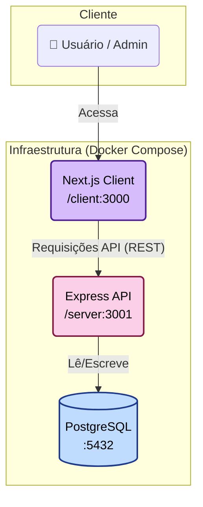

# ARQUITETURA DO PROJETO

## Diagrama da arquitetura



# Modelo de dados

- Optei por utilizar um banco de dados SQL como Postgres por alguns motivos:

  - Perceber entidades nas funcionalidades como: membros, intenções de participação, avisos, indicações e como elas se relacionam. Ex: um possível membro possui uma intenção de participação, membros tem acesso a avisos, que por sua vez são criados por admins. Indicações são feitas de um membro para outro, etc.

  - Garante integridade de dados através de chaves primárias e secundárias, assim como normalização, que garante um armazenamento eficiente e evita redudância de dados ao longo do tempo.

  - Como escolhi implementar o módulo opcional B (Dashboard de performance), vi uma vantagem em utilizar o modelo relacional pois será primordial pois as relações entre entidades são nítidas e ocorrerão através de JOINs entre múltiplas tabelas e agregações com COUNT e SUM, a fim de gerar relatórios detalhados, por exemplo.

- Dito isso, apresento abaixo o modelo de dados com tabelas, campos e relacionamentos.

```
CREATE TABLE intencoes (
    id UUID PRIMARY KEY DEFAULT gen_random_uuid(),
    nome VARCHAR(255) NOT NULL,
    email VARCHAR(255) NOT NULL UNIQUE,
    empresa VARCHAR(255),
    motivo TEXT,
    status status_intencao DEFAULT 'pendente',
    criado_em TIMESTAMP WITH TIME ZONE DEFAULT NOW()
);

CREATE TABLE usuarios (
    id UUID PRIMARY KEY DEFAULT gen_random_uuid(),
    nome VARCHAR(255) NOT NULL,
    email VARCHAR(255) NOT NULL UNIQUE,
    senha_hash VARCHAR(255) NOT NULL,
    empresa VARCHAR(255),
    papel papel_usuario DEFAULT 'membro',
    criado_em TIMESTAMP WITH TIME ZONE DEFAULT NOW()
);

CREATE TABLE convites (
    id UUID PRIMARY KEY DEFAULT gen_random_uuid(),
    email VARCHAR(255) NOT NULL,
    token VARCHAR(255) NOT NULL UNIQUE,
    intencao_id UUID REFERENCES intencoes(id),
    expira_em TIMESTAMP WITH TIME ZONE NOT NULL,
    usado_em TIMESTAMP WITH TIME ZONE,
    criado_em TIMESTAMP WITH TIME ZONE DEFAULT NOW()
);

CREATE TABLE reunioes (
    id UUID PRIMARY KEY DEFAULT gen_random_uuid(),
    data DATE NOT NULL,
    topico VARCHAR(255),
    criado_em TIMESTAMP WITH TIME ZONE DEFAULT NOW()
);

CREATE TABLE presencas (
    id UUID PRIMARY KEY DEFAULT gen_random_uuid(),
    usuario_id UUID NOT NULL REFERENCES usuarios(id) ON DELETE CASCADE,
    reuniao_id UUID NOT NULL REFERENCES reunioes(id) ON DELETE CASCADE,
    checkin BOOLEAN DEFAULT false,
    UNIQUE(usuario_id, reuniao_id)
);

CREATE TABLE indicacoes (
    id UUID PRIMARY KEY DEFAULT gen_random_uuid(),
    id_indicador UUID NOT NULL REFERENCES usuarios(id),
    id_indicado UUID NOT NULL REFERENCES usuarios(id),
    contato_nome VARCHAR(255) NOT NULL,
    descricao_oportunidade TEXT,
    status status_indicacao DEFAULT 'enviada',
    criado_em TIMESTAMP WITH TIME ZONE DEFAULT NOW()
);

CREATE TABLE agradecimentos (
    id UUID PRIMARY KEY DEFAULT gen_random_uuid(),
    id_agradecedor UUID NOT NULL REFERENCES usuarios(id),
    id_agradecido UUID NOT NULL REFERENCES usuarios(id),
    mensagem TEXT,
    indicacao_id UUID REFERENCES indicacoes(id),
    criado_em TIMESTAMP WITH TIME ZONE DEFAULT NOW()
);

CREATE TABLE encontros_1a1 (
    id UUID PRIMARY KEY DEFAULT gen_random_uuid(),
    membro1_id UUID NOT NULL REFERENCES usuarios(id),
    membro2_id UUID NOT NULL REFERENCES usuarios(id),
    data_encontro DATE NOT NULL,
    observacoes TEXT,
    criado_em TIMESTAMP WITH TIME ZONE DEFAULT NOW()
);

CREATE TABLE faturas (
    id UUID PRIMARY KEY DEFAULT gen_random_uuid(),
    usuario_id UUID NOT NULL REFERENCES usuarios(id),
    valor DECIMAL(10, 2) NOT NULL,
    vencimento DATE NOT NULL,
    status status_fatura DEFAULT 'pendente',
    pago_em TIMESTAMP WITH TIME ZONE,
    criado_em TIMESTAMP WITH TIME ZONE DEFAULT NOW()
);
```

# Estrutura de Componentes (Frontend)

```plaintext
/client
|
+-- /src
    |
    +-- /app                   # Páginas e rotas (App Router)
    |   |-- /admin             # Área administrativa (gerenciar candidaturas, membros)
    |   |-- /dashboard         # Dashboard do membro (indicadores e métricas)
    |   |-- /apply             # Formulário público de intenção de participação
    |   |-- /register          # Formulário de cadastro via token de convite
    |   |-- layout.tsx         # Layout raiz da aplicação
    |   `-- page.tsx           # Página inicial (landing)
    |
    +-- /components            # Componentes React reutilizáveis
    |   |-- /ui                # Componentes de interface
    |   |   ├── Button.tsx
    |   |   ├── Input.tsx
    |   |   ├── Card.tsx
    |   |   └── Modal.tsx
    |   |
    |   |-- /features          # Componentes de domínio
    |       ├── ApplicationList.tsx    # Listagem de candidaturas
    |       ├── ReferralForm.tsx       # Formulário de indicações
    |       ├── InvoiceTable.tsx       # Tabela de faturas
    |       └── DashboardMetrics.tsx   # Indicadores de performance
    |
    +-- /lib                   # Funções utilitárias
    |   ├── api.ts             # Cliente central de API
    |   ├── hooks.ts           # Hooks customizados
    |   └── utils.ts           # Funções genéricas (formatação, datas, etc.)
    |
    +-- /contexts              # Estado global (React Context)
        └── AuthContext.tsx    # Gerencia o usuário logado e permissões
```

A ideia aqui é separar as rotas por responsabilidade: criar componentes reautilizáveis tanto mais complexos quanto sem lógica e novos contextos a medida que for necessário para evitar prop drilling.

# Definição da API
